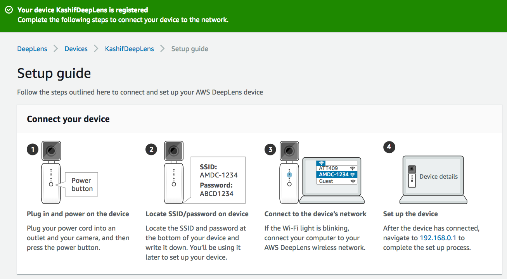
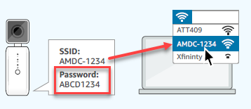
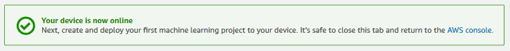

# Register your device

1. Sign in to the AWS Management Console and open the AWS DeepLens console at https://console.aws.amazon.com/deeplens/home?region=us-east-1#firstrun.
2. Choose Register device.
3. For Device name, type a name for your AWS DeepLens, then choose Next. Use only alphanumeric characters and dashes (-).
4. If this is your first time registering an AWS DeepLens device, create the following AWS Identity and Access Management (IAM) roles. They give AWS DeepLens the permissions it needs to perform tasks on your behalf. If you have already created these roles, skip to step 5.
- IAM role for AWS DeepLens
   - From the list, choose AWSDeepLensServiceRole. If AWSDeepLensServiceRole isn't listed, choose Create role in IAM and follow these steps in the IAM console.
   - Accept the DeepLens service and DeepLens use case by choosing Next: Permissions.
   - Accept the AWSDeepLensServiceRolePolicy policy by choosing Next: Review.
   - Accept the role name AWSDeepLensServiceRole and the provided description by choosing Create role. Do not change the role name.
   - Close the IAM window.

- IAM role for AWS Greengrass service
   - From the list, choose AWSDeepLensGreengrassRole. If AWSDeepLensGreengrassRole isn't listed, choose Create role in IAM and follow these steps in the IAM console.
   - Accept the Greengrass service and Greengrass use case by choosing Next: Permissions.
   - Accept the AWSGreengrassResourceAccessRolePolicy policy by choosing Next: Review.
   - Accept the role name AWSDeepLensGreengrassRole and the provided description by choosing Create role. Do not change the role name.
  - Close the IAM window.

- IAM role for AWS Greengrass device groups.
   - From the list, choose AWSDeepLensGreengrassGroupRole. If AWSDeepLensGreengrassGroupRole isn't listed, choose Create role in IAM and follow these steps in the IAM console.
   - Accept the DeepLens service and the DeepLens - Greengrass Lambda use case by choosing Next: Permissions.
   - Accept the AWSDeepLensLambdaFunctionAccessPolicy policy by choosing Next: Review.
   - Accept the role name AWSDeepLensGreengrassGroupRole and the provided description by choose Create role. Do not change the role name.
   - Close the IAM window.

- IAM role for Amazon SageMaker
   - From the list, choose AWSDeepLensSagemakerRole. If AWSDeepLensSagemakerRole isn't listed, choose Create role in IAM and follow these steps in the IAM console.
   - Accept the SageMaker service and the SageMaker - Execution use case by choosing Next: Permissions.
   - Accept the AmazonSageMakerFullAccess policy by choosing Next: Review.
   - Accept the role name AWSDeepLensSageMakerRole and the provided description by choosing Create role. Do not change the role name.
   - Close the IAM window.

- IAM role for AWS Lambda
   - From the list, choose AWSDeepLensLambdaRole. If AWSDeepLensLambdaRole isn't listed, choose Create role in IAM and follow these steps i the IAM console.
   - Accept the Lambda service and the Lambda use case by choosing Next: Permissions.
   - Accept the AWSLambdaFullAccess policy by choosing Next: Review.
   - Accept the role name AWSDeepLensLambdaRole and the provided description by choosing Create role. Do not change the role name.
   - Close the IAM window.

5. In AWS DeepLens, on the Set permissions page, choose Refresh IAM roles, then do the following:
   - For IAM role for AWS DeepLens, choose AWSDeepLensServiceRole.
   - For IAM role for AWS Greengrass service, choose AWSDeepLensGreengrassRole.
   - For IAM role for AWS Greengrass device groups, choose AWSDeepLensGreegrassGroupRole.
   - For IAM role for Amazon SageMaker, choose AWSDeepLensSagemakerRole.
   - For IAM role for AWS Lambda, choose AWSDeepLensLambdaRole.

   _Important, Attach the roles exactly as described. Otherwise, you might have trouble deploying models to AWS DeepLens._

   If any of the lists do not have the speified role, find that role in step 4, follow the directions to create the role, choose Refresh IAM roles, and return to where you were in step 5.

6. Choose Next.
7. On the Download certificate page, choose Download certificate, then choose Save File. Note where you save the certificate file because you need it later.
8. After the certificated has been downloaded, choose Register. You should see success message about your device registration like one below.

   _Important: The certificate is a .zip file. You attach it to AWS DeepLens in .zip format, so don’t unzip it. Certificates aren't reusable. You need to generate a new certificate every time you register your device._

## Connect Your AWS DeepLens Device

1. Start your AWS DeepLens device by plugging the power cord into an outlet and the other end into the back of your device. Turn on the AWS DeepLens by pressing the On/Off button on the front of the device.
2. On your computer, choose the SSID for your AWS DeepLens from the list of available networks. The SSID and password are on the bottom of your device.

3. Wi-Fi light should be blinking at this time. If Wi-Fi light is not blinking, you need to reset the device using a pin and restart the device.
4. If Wi-Fi light is blinking, connect to the wifi network of the device.

## Set Up Your AWS DeepLens Device

1. In a browser, open a new tab and navigate to http://192.168.0.1.

2. On the Device page:
- Connect to the network.
   - Choose your local network, type the password, then choose Next. If you are using Ethernet to connect to AWS DeepLens, choose the Ethernet option.
- Upload the certificate.
   - Locate and choose the certificate that you downloaded from the AWS DeepLens console, then choose Upload certificate.
   - The certificate is saved as a .zip file in your Downloads directory. Don't unzip the file. You attach the certificate as a .zip file.
- Configure device access.
   - Create a password for the device—You need this password to access and update your AWS DeepLens.
   - SSH server— Enable SSH as in the lab you will use SSH to connect to the device in later modules. SSH allows you to log in without using the AWS DeepLens console.
   - Automatic updates— Enable this option. Enabling automatic updates keeps your device's software up-to-date.
- Review the settings and finish setting up the device.
   - To modify settings, choose Edit for the setting that you want to change.
3. Choose Finish.

## Verify That Your AWS DeepLens Is Connected

After you set up your device, your computer automatically connects to the internet. This can take a few seconds. When your device is connected, you see the following message:

After the connection is established, you can return to the AWS DeepLens console. You are now ready to deploy an AWS DeepLens project. For more information, see Creating and Deploying an AWS DeepLens Sample Project.

If you fail to establish a connection, return to Connect AWS DeepLens to the Network and repeat the steps for setting up your device and connecting it to the network.

## Completion
You have successfully registered your Deeplens device. In the next module, [Object Detection](../2-ObjectDetection), you will learn how to deploy an object detection project to Deeplens and view its output.
