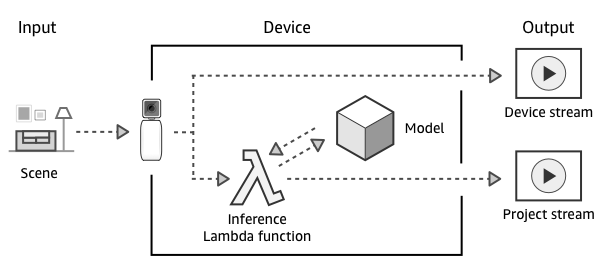

# Get to know your Device

AWS DeepLens is a wireless video camera and API. It shows you how to use the latest Artificial Intelligence (AI) tools and technology to develop computer vision applications. Through examples and tutorials, AWS DeepLens gives you hands-on experience using a physical camera to run real-time computer vision models.

The AWS DeepLens camera, or device, uses deep convolutional neural networks (CNNs) to analyze visual imagery. You use the device as a development environment to build computer vision applications.

AWS DeepLens works with the following AWS services:
- Amazon SageMaker, for model training and validation
- AWS Lambda, for running inference against CNN models
- AWS Greengrass, for deploying updates and functions to your device

## AWS DeepLens Hardware
The AWS DeepLens camera includes the following:

- A 4-megapixel camera with MJPEG (Motion JPEG)
- 8 GB of on-board memory
- 16 GB of storage capacity
- A 32-GB SD (Secure Digital) card
- WiFi support for both 2.4 GHz and 5 GHz standard dual-band networking
- A micro HDMI display port
- Audio out and USB ports

The AWS DeepLens camera is powered by an Intel® Atomprocessor, which can process 100 billion floating-point operations per second (GFLOPS). This gives you all of the compute power that you need to perform inference on your device. The micro HDMI display port, audio out, and USB ports allow you to attach peripherals, so you can get creative with your computer vision applications.

## Supported Frameworks
- Apache MXNet framework.

## How DeepLens Work

## Learning Objectives of This Lab

In this lab you will learn the following:

- Registering your Deeplens device.
- Creating a DeepLens project using the object detection template.
- Deploying model to the device.
- Checking the output on the video stream.
- Edit a pre-trained object recognition model in SageMaker to perform a binary classification
- Deploying newly trained model to the device

## Modules

