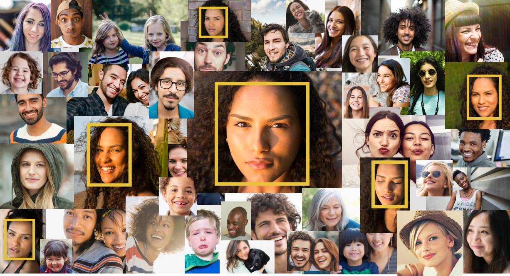
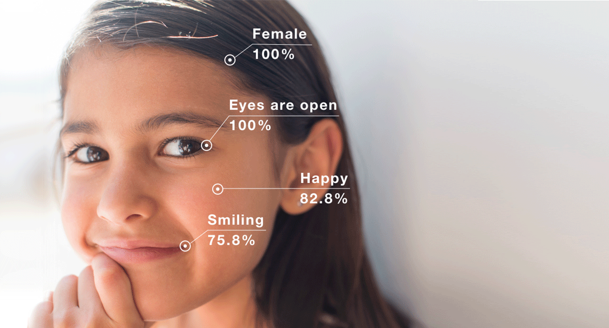
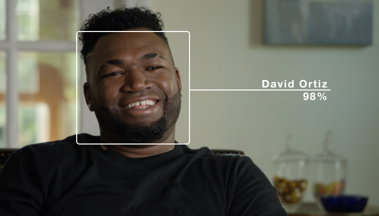
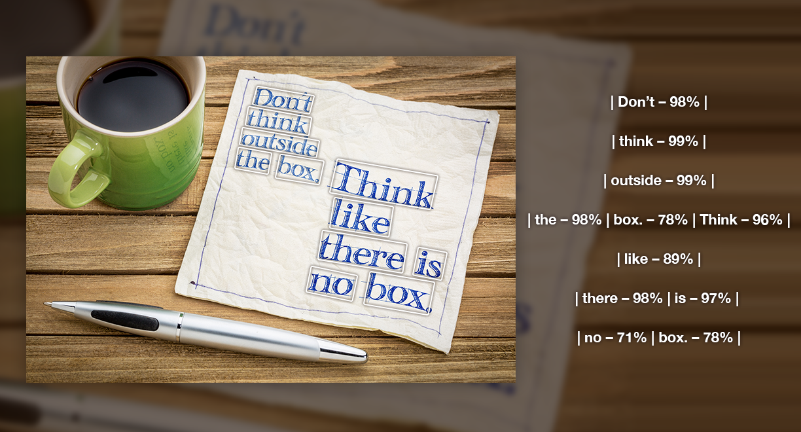
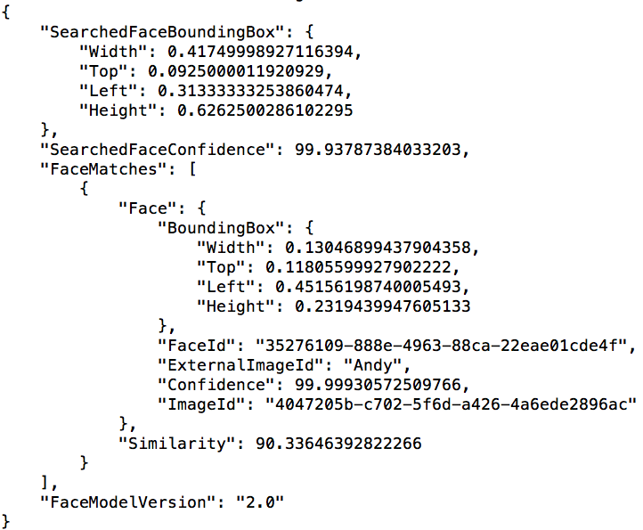

# Rekognition (Deep learning-based image and video analysis)

Amazon Rekognition provides Deep learning-based image and video analysis. It provides key features:
- Object, scene and activity detection

- Facial recognition

- Facial analysis

- Person tracking

- Unsafe content detection
- Celebrity recognition

- Text in images


## Rekognition Introduction
1. In AWS Console go to Rekognition at https://console.aws.amazon.com/rekognition/home?region=us-east-1#/.
2. In the left navigation click on Object and scene detection and notice how Rekognition return labels for objects and activities detected in the image.
3. In the left navigation click on Face comparison to see how Rekognition let you compare two faces and gives a confidence score on how closely they match.
4. You can explore other feature including Image moderation, Facial analysis, Celebrity recognition and Text in image.

## Rekognition Collections
Amazon Rekognition can store information about detected faces in server-side containers known as collections. You can use the facial information stored in a collection to search for known faces in images, stored videos and streaming videos. You will use AWS CLI to create and manage Rekognition collections.

### Configure AWS CLI
1.	Install the AWS CLI by following the instructions at the following link: https://docs.aws.amazon.com/cli/latest/userguide/installing.html
2.	Configure the AWS CLI by following the instructions at the following link: https://docs.aws.amazon.com/cli/latest/userguide/cli-chap-getting-started.html

### Create Rekognition Collection

_Rekognition will be consulted in order to check whether a face in the image sent by DeepLens is recognized (i.e. whether it exists in our Rekognition collection)._

1.	On your laptop, either open a terminal window (Mac) or cmd (Windows) in order to use the AWS CLI.
2.	Type the following AWS CLI command to create a Rekognition collection:
```
aws rekognition create-collection --collection-id "dl-faces" --region us-east-1
```
3.	Verify that your Rekognition collection has been created:
```
aws rekognition list-collections --region us-east-1
```
### Veiw/Add Faces to Rekognition Collection

1. With the following command, you will see that there are currently no faces in your newly-created collection:
```
aws rekognition list-faces --collection-id "dl-faces" --region us-east-1
```
2. Upload images [jb.jpg](jb.jpg), [andy1.jpg](andy1.jpg) and [andy2.png](andy2.png) to your S3 bucket _[Your name or username]-dl-faces_.

3. Add both jb.jpg and andy1.jpg to Rekognition collection
```
aws rekognition index-faces --image '{"S3Object":{"Bucket":"[Your name or username]-dl-faces","Name":"jb.jpg"}}' --external-image-id "JB" --collection-id "dl-faces" --detection-attributes "ALL" --region us-east-1
```
```
aws rekognition index-faces --image '{"S3Object":{"Bucket":"[Your name or username]-dl-faces","Name":"andy1.jpg"}}' --external-image-id "Andy" --collection-id "dl-faces" --detection-attributes "ALL" --region us-east-1
```
4.	Now list the faces in your collection again and you should see JSON response with two faces in your Rekognition collection.
```
aws rekognition list-faces --collection-id "dl-faces" --region us-east-1
```


### Search Face in Rekognition Collection
1. We will now use andy.png as source image to search faces stored in the Rekognition collection. You should see JSON response similar to below with it finding Andy's face with 99.9% confidence level.
```
aws rekognition search-faces-by-image --image '{"S3Object":{"Bucket":"[Your name or username]-dl-faces","Name":"andy2.png"}}' --collection-id "dl-faces" --region us-east-1
```


7. To delete a face from your collection, use the face-id that you get from list-faces command.
```
aws rekognition delete-faces --collection-id "dl-faces" --face-ids "FACE-ID-To-DELETE, GET FaceID FROM list-faces"
```

## Completion
You have successfully created a Rekognition collection and will use it in following modules to verify incoming faces from Deeplens. In the next [Approval Workflow](../3-Approval Workflow), you will learn how to build an approval workflow before sending incoming image from Deeplens to Rekognition collection.
