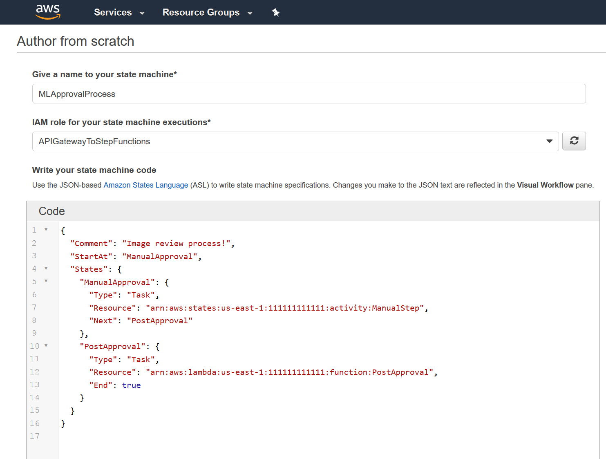
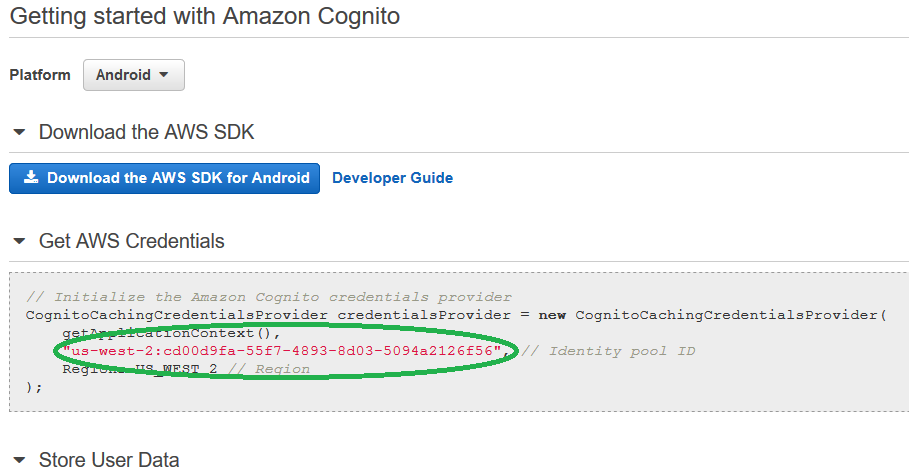
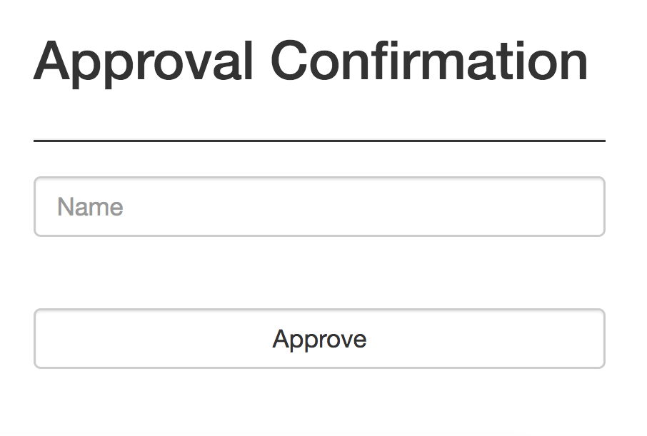

# Approval Workflow (Step Functions, API GW and Approval Website)

In the next module you will learn how to build an approval workflow before sending incoming image from Deeplens to Rekognition collection.

## Create IAM Roles for API Gateway and Step Functions

### Create IAM Role for API Gateway to Step Functions

_As seen in the architecture diagram, API gateway will be used to invoke the 2nd Step Function.  We need to create an IAM role to allow this to happen._

1.	To access the IAM Console: In the AWS Console, click on “Services” in the top, left-hand corner of the screen, and click on “IAM” (you can find it by typing _iam_ into the search field at the top of the screen).
2.	On the left-hand side of the screen, click "Roles", and then click “Create Role”.
2.	Click “AWS service” and click “API Gateway”.
3.	Click “Next: Permissions” (at the bottom of the screen).
4.	Click “Next: Review” (at the bottom of the screen).
5.	In the “Role name” text box, type _APIGatewayToStepFunctions_
6.	Click “Create role” (at the bottom of the screen).
7.	On the left-hand side of the screen, click "Roles", search for your role (APIGatewayToStepFunctions) and then click on that role.
8.	On the Permissions tab, choose "Attach Policy".
9.	On the Attach Policy page, type _step_ into the search field and click the checkbox to the left of "AWSStepFunctionsFullAccess".
10.	Click "Attach Policy".


### IAM Role for Step Functions to Lambda

_As seen in the architecture diagram, Step Functions will be used to invoke the PostApproval Lambda function.  We need to create an IAM role to allow this to happen._

1.	In the IAM Console, on the left-hand side of the screen, click "Roles", and then click “Create Role”
2.	Click “AWS service” and click “Step Functions”.
3.	Click “Next: Permissions” (at the bottom of the screen).
4.	Click “Next: Review” (at the bottom of the screen).
5.	In the “Role name” text box, type _StepFunctionstoLambda_
6.	Click “Create role” (at the bottom of the screen).

## Configure Step Functions

_We will use the AWS Step Functions service to define and control our overall workflow.  (For more information: https://aws.amazon.com/step-functions)_

1. Go to StepFunction in AWS Console at https://console.aws.amazon.com/states/home?region=us-east-1#/
2. In the left navigation, click "Tasks", then click "Create new activity".
3. Type ManualStep in the "Activity Name" textbox, and then click "Create Activity".
4. In the left navigation, click on Dashboard and click Create a state machine
5. Choose "Author from scratch" and for the name, type _MLApprovalProcess_.
6. For the IAM Role, choose the APIGatewayToStepFunctions role that your created above.
7.	In the "Code" section, paste the following code and **replace the strings 111111111111 with your own AWS account Id**:
```{
  "Comment": "Image review process!",
  "StartAt": "ManualApproval",
  "States": {
    "ManualApproval": {
      "Type": "Task",
      "Resource": "arn:aws:states:us-east-1:111111111111:activity:ManualStep",
      "Next": "PostApproval"
    },
    "PostApproval": {
      "Type": "Task",
      "Resource": "arn:aws:lambda:us-east-1:111111111111:function:PostApproval",
      "End": true
    }
  }
}
```



### Test Step Functions

1.	While still in the step functions console, on the left-hand side of the screen, click “Dashboard”.
2.	Click directly on the state machine you just created (not on the radio button next to it) and then click “New execution”.
3.	Enter a name for the execution test and then click “Start execution” (see screenshot below).


4.	This will simply go into the ManualApproval activity for now:


5.	Now click “Stop execution” in the top, right-hand corner of the screen.

## Configure API Gateway

1.	Save the following Swagger file to your computer: [API Gateway Swagger File](./APIGatewayToStepFunctions-respond-swagger-apigateway.yaml), open the file for editing, and substitute all instances of the string **111111111111** with your own AWS account number.
2.	In the AWS Console, click on “Services” in the top, left-hand corner of the screen, and click on “API Gateway” (you can find it by typing api into the search field at the top of the screen).
3.	Click "Get Started", and then click "OK".
4.	Select the "Import from Swagger" option (see screenshot below).


5.	Click “Select Swagger File” and upload the swagger file you created in step 1 above.
6.	Click "Import" (in the bottom, right-hand corner of the screen).
7.	In the "Resources" section for your API, click the "Actions" drop-down menu and select "Deploy API". Enter the following details:
o	 Deployment stage: [New Stage]
o	Stage name: respond
8.	Click "Deploy".
9.	Note the "Invoke URL" that gets created for this API.  Copy this to a text file because you will need it in a later step (see example screenshot below).


10.	Paste the invoke URL into a browser tab to ensure that the API is responding. For now it will just return an error saying “{"message":"Missing Authentication Token"}”, which is expected at this point, because the request has not gone through the expected end-to-end workflow.

## Approval Verification Website

### Create Cognito Identity Pool

_Cognito will be used to assign temporary credentials for securely accessing AWS resources used in this workshop. (For more information: https://aws.amazon.com/cognito/)_

1.	In the AWS Console, click on “Services” in the top, left-hand corner of the screen, and click on “Cognito” (you can find it by typing _cog_ into the search field at the top of the screen).
2.	Click “Manage Federated Identities”, and then click “Create new identity pool”.
3.	For “Identity pool name”, enter _ML_ID_Pool_
4.	Select “Enable access to unauthenticated identities” from the “Unauthenticated identities” collapsible section.
5.	Click “Create Pool”.
6.	In the screen that appears, click “Allow” (in the bottom, right-hand corner of the screen).
7.	Note the identity pool ID that is displayed in the center of the screen (please see the following example screenshot).



8.	Copy that into a text file because you will use it in a later step.

### Update the Cognito IAM Role to Allow Access to AWS Resources

1.	In the AWS Console, click on “Services” in the top, left-hand corner of the screen, and click on “IAM” (you can find it by typing _iam_ into the search field at the top of the screen).
2.	On the left-hand side of the screen, click "Roles".
3.	In your list of roles, click on “Cognito_ML_ID_PoolUnauth_Role”, and click “Attach policy”.
4.	In the Search field, type _s3_, and then select “AmazonS3FullAccess” (i.e. click the checkbox to the left of “AmazonS3FullAccess”).
5.	In the Search field, type _step_, and then select “AWSStepFunctionsFullAccess”.
6.	In the Search field, type _rek_, and then select “AmazonRekognitionFullAccess”.
7.	In the Search field, type _dyn_, and then select “AmazonDynamoDBFullAccess”.
8.	In the Search field, type _ses_, and then select “AmazonSESFullAccess”.
9.	In the Search field, type _api_, and then select “AmazonAPIGatewayInvokeFullAccess”.
10.	Click “Attach policy” (at the bottom, right-hand corner of the screen).
11.	Repeat steps 1 to 10 for the “Cognito_ML_ID_PoolAuth_Role”.

### Create S3 Bucket for Static Website Hosting

_We will use a static website to host a web-page that will be used for approving unrecognized faces to be added to our Rekognition collection._

1. In the AWS Console, click on “Services” in the top, left-hand corner of the screen, and click on “S3” (you can find it by typing _s3_ into the search field at the top of the screen).
2. Click "Create bucket", and enter the following details:
*	Bucket name: [Your name or username]-dl-web
*	Region: US East-1 (Virginia)
2.	Click "Create".
3.	Now, in your list of S3 buckets, click on the bucket you just created (i.e. [Your name or username]-dl-web]).
4.	Click on the "Properties" tab and click on "Static website hosting".
5.	Select the "Use this bucket to host a website" option.
6.	In the "Index document" textbox, type index.html
7.	Click "Save".

### Create the Approval Static Web Page

_The document at the following link contains the HTML code for the static web page that will be used for allowing manual approval of images to be added to the Rekognition collection: [index.html](./index.html)_

1. Copy the _[index.html](./index.html)_ file to your computer, save it as index.html, and make the following substitution:
```
cognitoIdentityPoolId = 'YOUR-IdentityPoolId'
apiGatewayUrl = 'https://YOUR-APIGatewayEndPoint.execute-api.us-east-1.amazonaws.com/respond/succeed'
```
_Next, we will upload that file to S3 according to the following steps:_

1. Go to S3 in AWS Console at https://s3.console.aws.amazon.com/s3/home?region=us-east-1
2. In your list of S3 buckets, click on the bucket [Your name or username]-dl-web you created above and click Upload.
3. Click Add files and select the index.html from your computer.
4. Under Manage public permissions, select "Grant public read access to this object(s)".


5. Click Next, Next and upload.
6. Replace [Your name or username]-dl-web in the URL below with the name of your S3 bucket that is hosint index.html
```
http://[Your name or username]-dl-web.s3-website-us-east-1.amazonaws.com
```
7. You should see approval page like one below:



## Completion
You have successfully created state machine in StepFunction, API Gateway and approval website to manage the approval workflow for images coming from Deeplens. In the next [Bringing it All Together](../4-BringingItAllTogether), you will learn create lambda function to initiate workflow.
