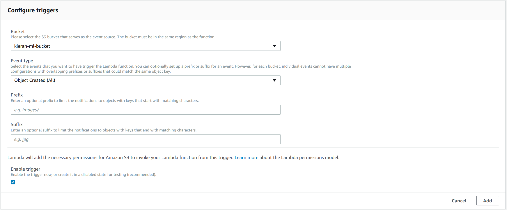
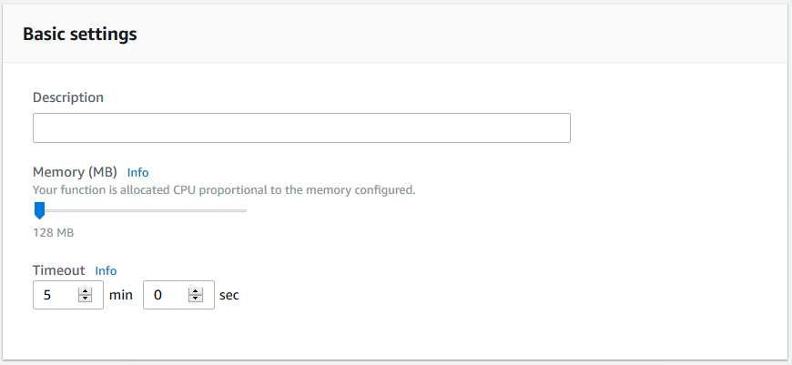

# Lab 6 - Bringing it All Together (Create DynamoDB Table and Lambda Functions)

## 1. Create DynamoDB Table

1.	In the AWS Console, click on “Services” in the top, left-hand corner of the screen, and click on “DynamoDB” (you can find it by typing _dyn_ into the search field at the top of the screen).
2.	Click "Create table", and enter the following details:
* Table name: MLApprovals
*	Primary key: Token  
3.	Click "Create".

## 2. Create Lambda Functions

### 2.1 Create the “StartWorkflow” Lambda Function

_This function will be the heart of the entire workflow.  It will check to see if the face in the image sent from DeepLens exists in a Rekognition collection.  If so, it will simply send an email to notify you that this person was seen by the DeepLans device. If not, it will send an email to ask if you want to approve this face and add it to your Rekognition collection._

1.	In the AWS Console, click on “Services” in the top, left-hand corner of the screen, and click on “Lambda” (you can find it by typing _lambda_ into the search field at the top of the screen).
2.	Click “Create a function”, and enter the following details:
* Name: StartWorkflow
* Runtime: Python 3.6
* Role: Choose an existing role
* Role name: AI_ML_Lambda_Role

3.	Click “Create function”.
4.	In the "Add Triggers" section on the left-hand side of the page, click "S3" (see screenshot below).

5.	In the "Configure triggers" section that appears at the bottom of the screen, configure the following details:
* Bucket: [Select the name of the bucket you created in section 1, step 2 above]
* Event type: Object Created (All)
* Enable trigger: Yes [Checked]

6.	Click "Add" (at the bottom of the page), and then click "Save" (at the top of the page).
8.	Now click on the "StartWorkflow" icon in the center of the screen, and a "Function code" section will appear at the bottom of the screen (scroll down).
e.g.

9.	Delete the existing code in that section, and replace it with the code in Appendix A of this document.
10.	In the code that you have just pasted, you will see two instances of the following string (search for them): 111111111111
11.	You must replace those instances with your own AWS Account number, which you noted in step 7 above.
12.	Also in the code that you have just pasted, you will see one instance of the following string (it's near the end of the code): ki-aiweek-web
13.	You must replace that with name of the bucket you created in section 1.2, step 1 above.
14.	Also in the code that you have just pasted, you will see the following lines:
* SENDER = "kashii@amazon.com"
* RECIPIENT = "kashii@amazon.com"
15.	You must replace those email addresses with your own email address (the same one you registered with SES in Lab 3).
16.	Scroll down further, and in the “Basic Settings” section, set the timeout to 5 minutes (see screenshot below).

17.	Click "Save" (at the top of the screen).

## 2.2 Test the “StartWorkflow” Lambda Function

_We will create a test event within the Lambda console._

1.	While still in the Lambda Console screen for the function you just created, scroll to the top of the web-page, and click the drop-down menu that says “Select a test event”, and then click “Configure test events”.
2.	In the screen that appears (see screenshot below), click “Create new test event”.
3.	In the “Event template” drop-down menu, select “S3 Put”.

4.	A set of auto-generated code will appear when you select that option.  In that code, change the key to the name of the test image you uploaded to your ML bucket when you created it (see screenshot below), and change the bucket name to the name of your ML bucket.

5.	Click “Save”.
6.	Now, in the top, right-hand corner of the console screen, click the “Test” button.
7.	At this point you should receive an email asking you to approve the photo.  Go ahead and click the link in the email in order to verify that you can access that it brings you to the approval website.  However, note that it is not yet possible for us to approve the image.  We need to create the 2nd Lambda function for the approval process.

## 2.3 Create the “PostApproval” Lambda Function

_This function will actually add the image to our Rekognition collection, so that it will be recognized on subsequent attempts._
1.	In the AWS Console, click on “Services” in the top, left-hand corner of the screen, and click on “Lambda” (you can find it by typing _lambda_ into the search field at the top of the screen).
2.	Click “Create a function”, and enter the following details:
* Name: PostApproval
* Runtime: Python 3.6
* Role: Choose an existing role
* Role name: AI_ML_Lambda_Role
3.	Click “Create function”.
4.	In the "Add Triggers" section on the left-hand side of the page, click "API Gateway".
5.	Click "Add" (at the bottom of the page), and then click "Save" (at the top of the page).
6.	Now click on the "PostApproval" icon in the center of the screen, and a "Function code" section will appear at the bottom of the screen (scroll down).
7.	Delete the existing code in that section, and replace it with the code in Appendix B of this document.
8.	Click “Save”.

**Time to test!!!**
