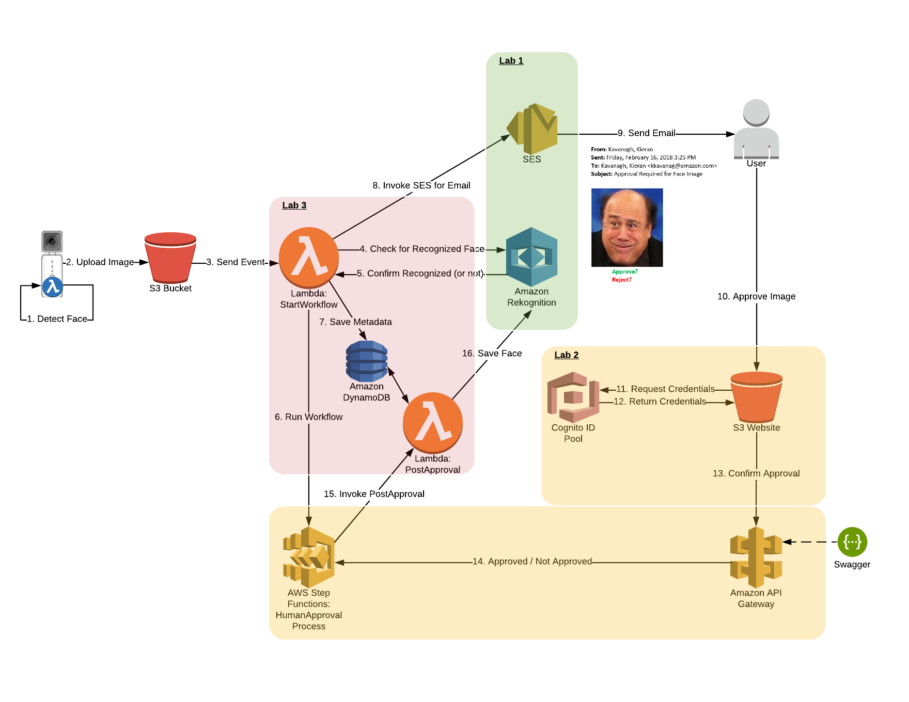

# End-to-end solution for face detection, recognition and verification

- Building face detection, recognition and verification system, including:
   - Deploy the face detection model to the device
   - Modify the lambda function to crop faces and send them to the S3 bucket
   - Check if face exists in Rekognition collection
   - If it is a new face, use step function to start an approval process to add face to collection

[1-Face Detection](1-FaceDetection)
