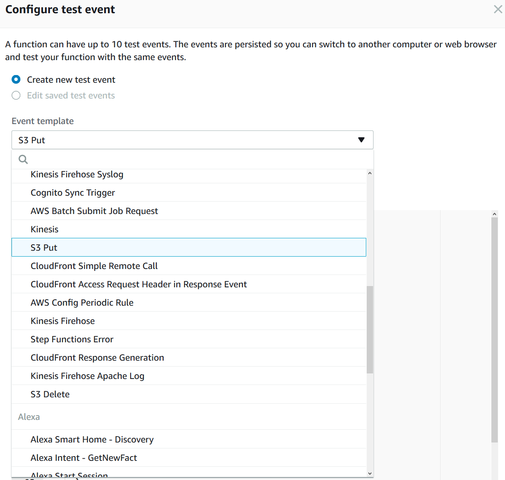
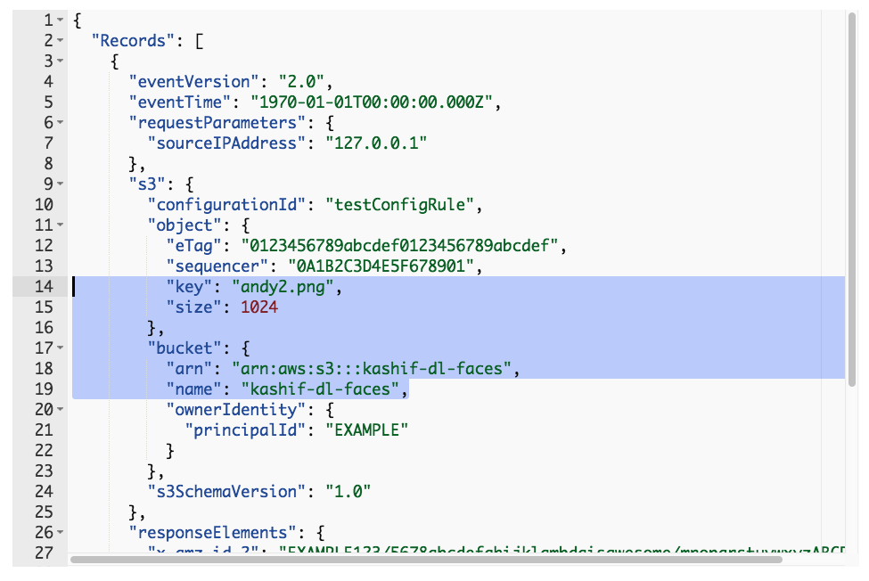
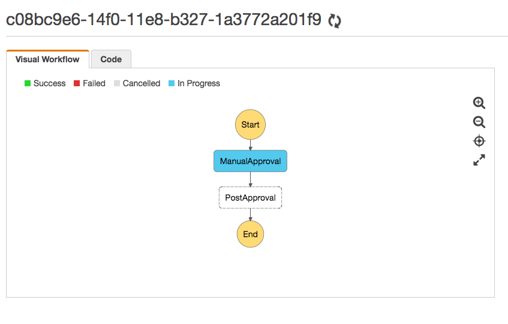

# Bringing it All Together

## Register Your Email Address With SES

_SES will be used to send an email from the “StartWorkflow” Lambda function we will create later in this workshop.  In order to do this, your email address must be registered with SES._

1.	In the AWS Console, click on “Services” in the top, left-hand corner of the screen, and click on “Simple Email Service” (you can find it by typing _ses_ into the search field at the top of the screen).
2.	Click on “Manage Identities”
3.	On the left-hand side of the page, click “Email Addresses”, and then click “Verify a New Email Address”.
4.	Enter your email address and click “Verify This Email Address”.
5.	A verification email will be sent to your email address.  Open your email and click the verification link in that email.

## Create DynamoDB Table

1.	In the AWS Console, click on “Services” in the top, left-hand corner of the screen, and click on “DynamoDB” (you can find it by typing _dyn_ into the search field at the top of the screen).
2.	Click "Create table", and enter the following details:
* Table name: DLApprovals
*	Primary key: ImageId  
3.	Click "Create".

## Create Lambda Functions

### Create the “StartWorkflow” Lambda Function

_This function will be the heart of the entire workflow.  It will check to see if the face in the image sent from DeepLens exists in a Rekognition collection.  If so, it will simply send an email to notify you that this person was seen by the DeepLans device. If not, it will send an email to ask if you want to approve this face and add it to your Rekognition collection._

1. Go to Lambda in AWS Console at https://console.aws.amazon.com/lambda/home?region=us-east-1#/functions.
2.	Click “Create a function”, and enter the following details:
* Name: StartWorkflow
* Runtime: Python 3.6
* Role: Choose an existing role
* Role name: DL-Lambda-Role
3.	Click “Create function”.
4.	In the "Add Triggers" section on the left-hand side of the page, click "S3" (see screenshot below).


5.	In the "Configure triggers" section that appears at the bottom of the screen, configure the following details:
* Bucket: _[Your name or username]-dl-faces_ This is the bucket where images from Deeples are being stored]
* Event type: Object Created (All)
* Enable trigger: Yes [Checked]
6.	Click "Add" (at the bottom of the page), and then click "Save" (at the top of the page).
8.	Now click on the "StartWorkflow" icon in the center of the screen, and a "Function code" section will appear at the bottom of the screen (scroll down).
e.g.


9.	Delete the existing code in that section, and replace it with the code from [startworkflow.py](startworkflow.py).
10. Update following lines in the lambda_handler according to your environment.
```
#########Update according to your environment #########################
#API Gateway end point URL
apiGatewayUrl = 'https://YOUR-APIGW-ENDPOINT.execute-api.us-east-1.amazonaws.com/respond/'
#URL for S3 Hosted Approval Website
approvalWebsiteUrl = 'http://YOUR-S3BUCKET-web.s3-website-us-east-1.amazonaws.com'
#Rekognition Collection Name
rekognitionCollection = 'YOUR-REKOGNITION-COLLECTION'
#Step Function State Machine Arn
stateMachineArn = 'arn:aws:states:us-east-1:YOUR-AWS-ACCOUNT-ID:stateMachine:MLApprovalProcess'
#Step Function Activity Arn
activityArn = 'arn:aws:states:us-east-1:YOUR-AWS-ACCOUND-ID:activity:ManualStep'
#Email information
emailSender = "YOUR-EMAIL-ADDRESS"
emailRecipient = "YOUR-EMAIL-ADDRESS"
emailSubject = "Approval needed for image"
#DynamoDB Table
dynamoTable = 'YOUR-DYNAMODB-TABLE'
#########Update according to your environment #########################
 ```
11.	Scroll down further, and in the “Basic Settings” section, set the timeout to 5 minutes.


17.	Click "Save" (at the top of the screen).

### Test the “StartWorkflow” Lambda Function

_We will create a test event within the Lambda console._

1.	While still in the Lambda Console screen for the function you just created, scroll to the top of the web-page, and click the drop-down menu that says “Select a test event”, and then click “Configure test events”.
2.	In the screen that appears (see screenshot below), click “Create new test event”.
3.	In the “Event template” drop-down menu, select “S3 Put”.



4. A set of auto-generated code will appear when you select that option.  In that code, change the key to andy.png and the bucket name to S3 buck where images from Deeplens are being stored _[YourName-dl-faces]_.



5. Click “Save”.
6. Now, in the top, right-hand corner of the console screen, click the “Test” button.
7. At this point you should receive an email asking you to approve/reject the photo.


8. Go ahead and click the Approve link and that should open the approval website.


9. Go to StepFunctions in AWS console at https://console.aws.amazon.com/states/home?region=us-east-1#/ and click on the state machine _MLApprovalProcess_
10. You should see current execution with status "Running".


11. Click on the arn of the execution to see more details.



12. Go back to the approval email and click the Reject link. It should take you to API GW and return {} if request if successful.

### Create the “PostApproval” Lambda Function

_This function will actually add the image to our Rekognition collection, so that it will be recognized on subsequent attempts._
1. Go to Lambda in AWS Console at https://console.aws.amazon.com/lambda/home?region=us-east-1#/functions.
2.	Click “Create a function”, and enter the following details:
* Name: PostApproval
* Runtime: Python 3.6
* Role: Choose an existing role
* Role name: DL-Lambda-Role
3.	Click “Create function”.
4.	Delete the existing code in that section, and replace it with the code from [postapproval.py](postapproval.py).
5. Update line below with the name of your Rekognition collection.
```
rekognitionCollection = 'YOUR-REKOGNITION-COLLECTION'
dynamodbTableName = 'YOUR-DYNAMODB-TABLE'
```
6.	Click “Save”.

## End to End Test
As Deeplens now detect a face, you should get an email if face already exist in your Rekognition collection. If face does not exist, you should get an email to approve/reject wheter that face should be added to your Rekognition collection.

## Completion
You have successfully build and end to end solution to detect faces using Deeples, and recognize those using Rekognition.
