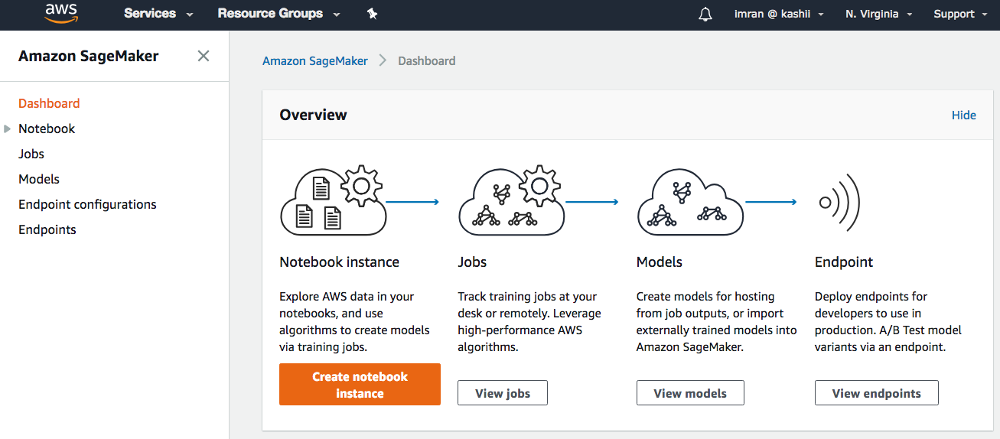
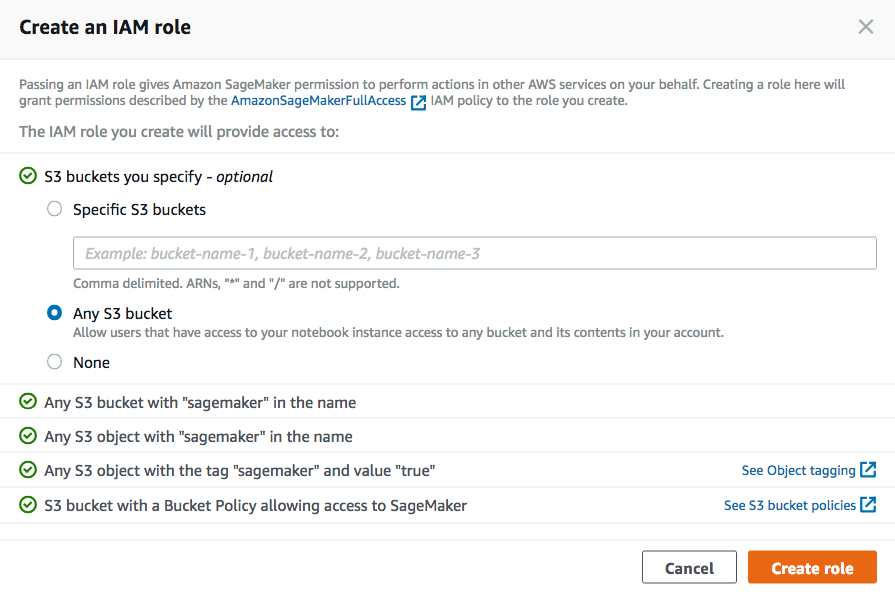
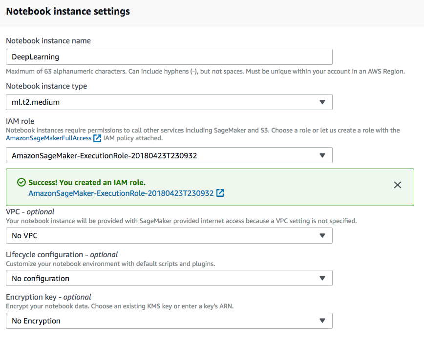
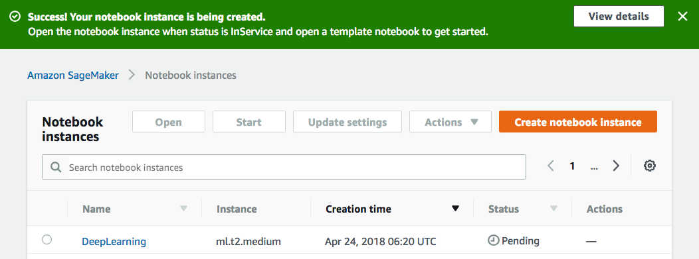

# Build, train and deploy Face Detection model using Amazon SageMaker

In this module, you will learn how to build and train a face detection model using Amazon SageMaker.

## Create SageMaker Notebook Instance

1. Go to SageMaker console at https://console.aws.amazon.com/sagemaker/home?region=us-east-1#/landing
  ___Make sure you have us-east-1 selected as region.___

2. Click on Create Notebook instance

3. Under Notebook instance settings:
- Notebook instance name: Enter a name eg: DeepLearning
- Notebook instance type: ml.t2.medium
- IAM role: Click on 'Create a new role'
  - Under Create an IAM role: Select "Any S3 bucket" and click "Create role".
  
- Leave defaults for VPC, Lifecycle configuration and encryption key:

- Click 'Create notebook instance'
- You should see message on the next screen that your notebook instance is being created.

## View notebook instances

You can view all your notebook instances by choosing Notebook on the left menu. It will take couple of minutes for the notebook instance to be created.

### Step 4- Upload and Open notebook

Choose Upload button on the jupyter page

Find the SSD_Object_Detection_SageMaker_v3.ipynb file (You can find it in the sagemaker lab directory of the extracted repo. You downloaded and extracted the zip file earlier in the process)

Choose Upload

You can choose your uploaded notebook and click on 'Open'.

This will open your Jupyter notebook.

### Step 5- Execute notebook

1. Execute the cells by clicking on run button or using shift+ enter on your keyboard

