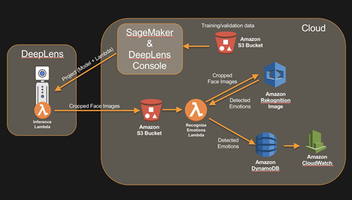

# Build sentiment analysis system using DeepLens and Amazon Rekognition

### Learning Objectives of This lab
In this lab your will the following:
- Create an S3 bucket.
- Modify the DeepLens inference lambda function to upload cropped faces to S3 bucket.
- Deploy the inference lambda function and face detection model to DeepLens.
- Create lambda function to call Amazon Rekognition and identify emotions of incoming faces.
- Create a DynamoDB table to store recognized emotions.
- Analyse results using CloudWatch.

## Modules

This lab has following modules:

- [Detect Faces](1-DetectFaces)
- [Identify Emotions](2-IdentifyEmotions)

## Clean Up
After completing the labs in this workshop ensure you delete all the resources created in your AWS account during the labs so that no further costs are incurred.
